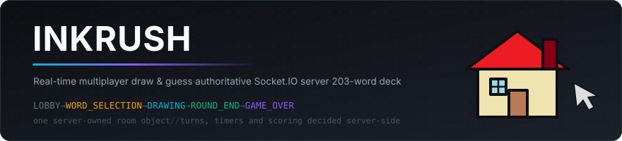
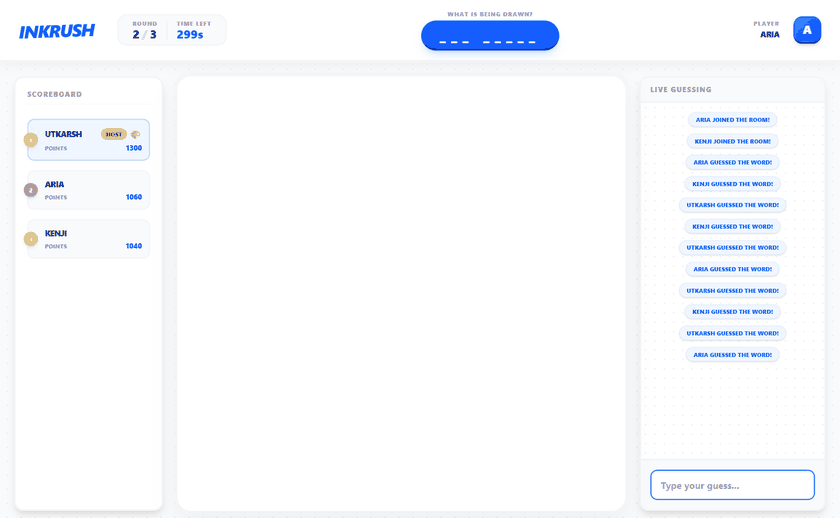
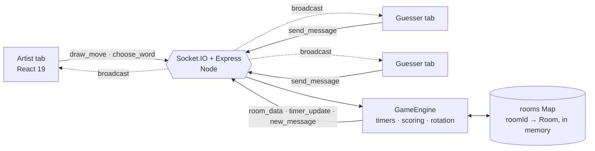
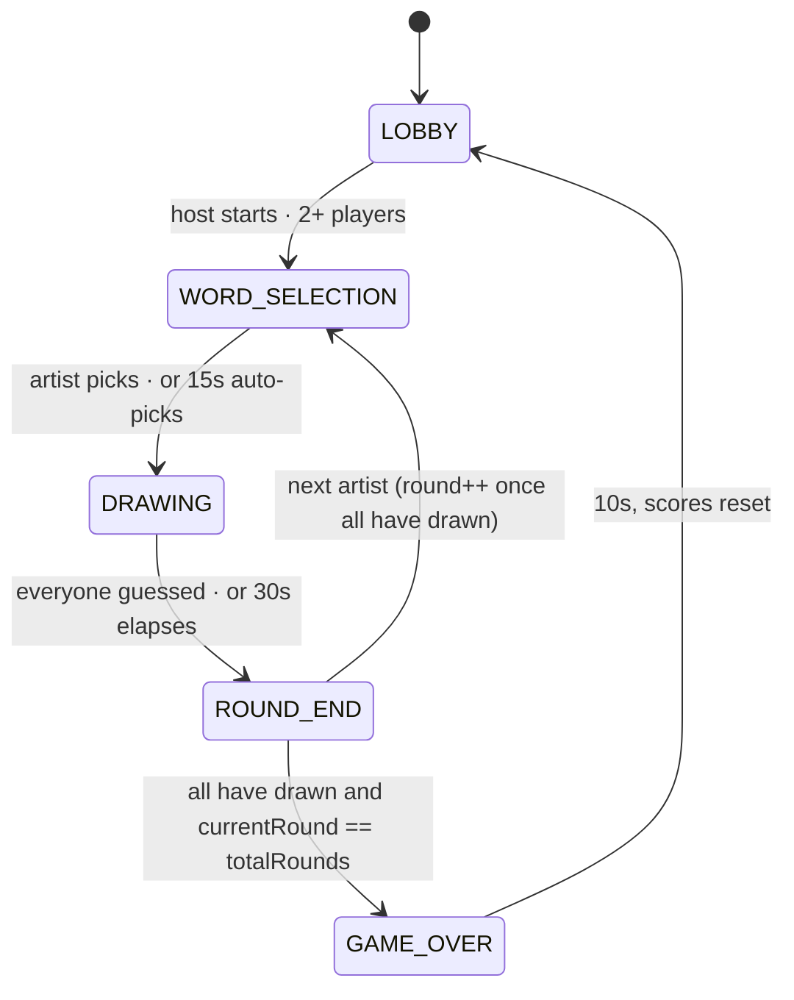
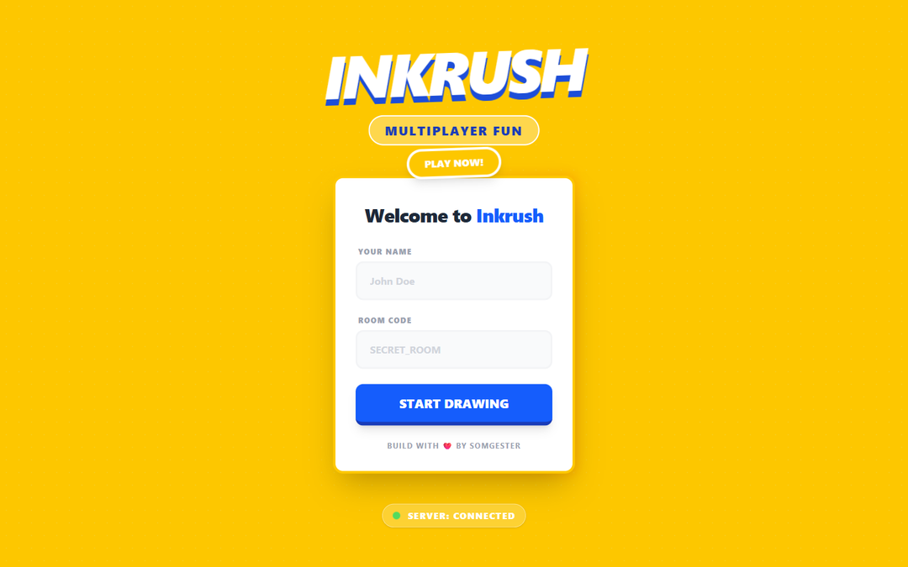
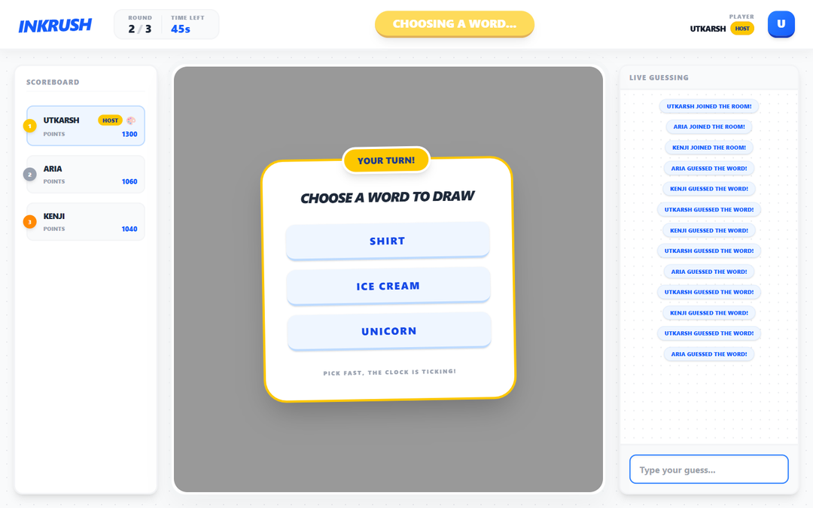
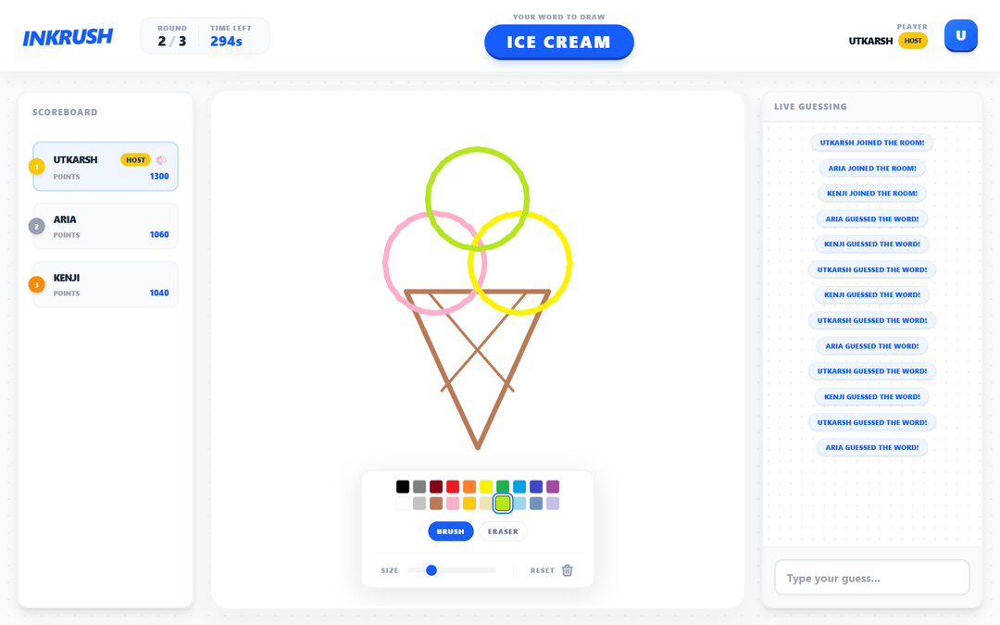
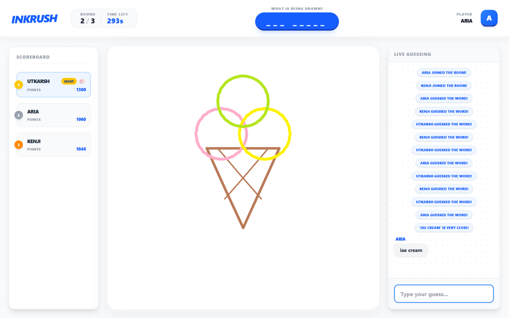
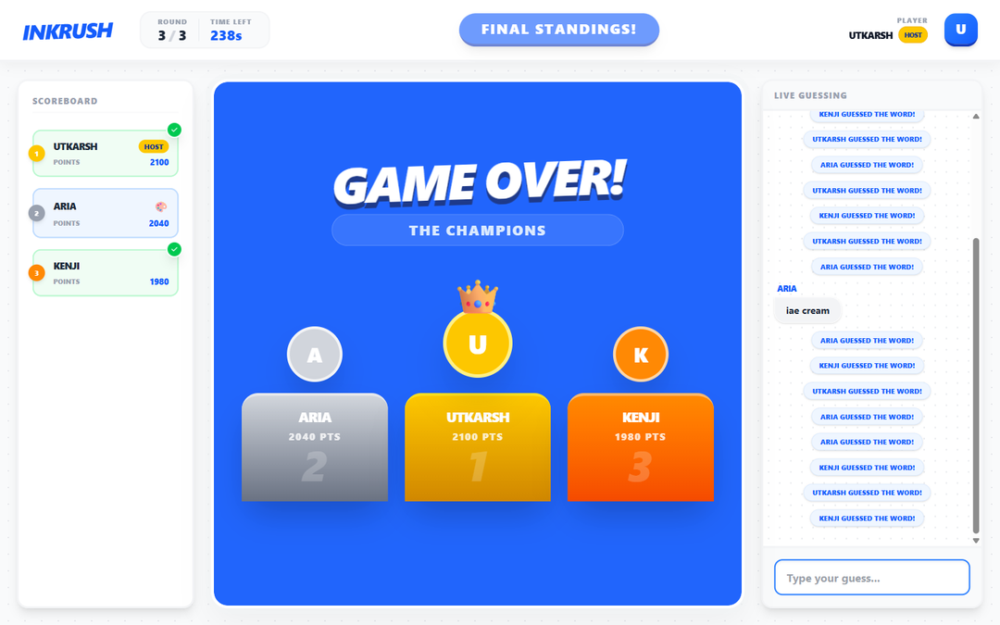

<div align="center">



**A real-time draw-and-guess party game where one Node server owns every rule — turn order, timers, scoring and near-miss detection — while the browser only captures ink and renders what it is told.**


</div>

## What it does

Players join a room with a name and a room code. Each turn the server picks an artist who has not drawn yet, offers them three words from a 203-word deck, and starts a countdown. The artist's strokes stream to every other tab as they happen; everyone else races to type the word into chat. Guess first and you score the most — every player who guesses after you scores less, and the artist earns a bonus for each person who works it out. After every player has taken a turn the round advances, and when the rounds run out the game drops into a podium.

The recording below is a real three-player match driven end to end through the running app — the artist draws `ice cream`, the strokes land live on a guesser's canvas, a one-letter typo gets flagged as *very close*, and the correct guess flips the scoreboard.

<div align="center">

</div>

The neatest idea in the codebase is how a stroke is put on the wire. Instead of shipping pixels, `Canvas.tsx` sends the two endpoints of each segment as fractions of the canvas — `{ x: 0.62, y: 0.31, prevX: 0.58, prevY: 0.28, color, width }` — and every receiver multiplies them back up by its own canvas size. A 4K monitor and a phone in portrait get geometrically identical drawings out of the same six fields, and because the payload is resolution-free the same handler that draws a local stroke also draws a remote one. Resizing the window would normally wipe an immediate-mode canvas; the component snapshots the bitmap with `toDataURL()` before resizing and replays it after, so the picture survives.

## By the numbers

| Metric | Value | Measured from |
|---|---|---|
| Game server | **544 lines** of TypeScript across 6 files | `backend/src` |
| Word deck | **203 words**, 5 of them multi-word | `words.ts` |
| Socket protocol | **7 inbound**, **5 outbound** events | `server.ts` + `gameEngine.ts` |
| Tunable rules | **16 env knobs**, every one with a default | `config.ts` |
| Client bundle | **258.33 kB** JS (**79.44 kB** gzipped) + 44.27 kB CSS | `vite build`, 51 modules |
| Production build | **348 ms** for the Vite pass, 5.4 s including `tsc -b` | timed run |
| Recorded match | 3 players × 3 rounds = **9 turns**, final 2100 / 2040 / 1980 | the session in the GIF |

## Highlights

- **Server-authoritative by construction.** One `Room` object per room holds status, players, scores, timer and artist. Clients emit intent (`join_room`, `choose_word`, `send_message`) and re-render whatever `room_data` comes back — no score, timer, or turn decision is ever made in the browser.
- **A real state machine, not a pile of booleans.** `GameStatus` is a five-value union and `GameEngine` is the only thing allowed to move between them, each transition owning its own `setInterval` that is always cleared before the next one starts.
- **Resolution-independent stroke sync.** Normalised 0–1 coordinates plus resize-safe canvas replay (see above).
- **Near-miss detection that does not leak the answer.** A hand-written Levenshtein distance flags guesses exactly one edit away from the word. The *"'iae cream' is very close!"* nudge goes only to the socket that typed it; the guess itself still appears in chat like any other message.
- **Decay scoring.** The first correct guesser takes the full award, each subsequent guesser takes 50 fewer points (by default) down to a floor, and the artist banks a bonus per solver — so drawing well pays and guessing fast pays more.
- **Fair rotation.** `drawnPlayerIds` guarantees every player in the room draws before the round counter moves, which is a different thing from "advance the round every turn" and the reason a 3-player, 3-round game is 9 turns, not 3.
- **Graceful disconnects.** Losing the artist ends the turn instead of hanging it, host status migrates to the next player, rooms delete themselves when the last player leaves, and a room that drops below the minimum ends the game rather than stalling.
- **Free-tier keep-alive.** A GitHub Actions cron pings `/health` every five minutes so the hosted backend never cold-starts mid-game.

## Architecture



`draw_move` and `clear_canvas` are relayed straight to the other sockets in the room so ink stays smooth, while everything that affects the outcome — who draws, what the clock says, who scored — round-trips through `GameEngine` and comes back as a single `room_data` broadcast. Rooms live only in memory, so there is no database to run and a restart is a clean slate.



## Quick start

Node 20.19+ or 22.12+ (Vite 8's requirement) and two terminals. Every rule has a built-in default, so the server runs with no configuration at all.

```bash
# terminal 1 — game server on http://localhost:5000
cd backend
npm install
npm run dev

# terminal 2 — client on http://localhost:5173
cd frontend
npm install
npm run dev
```

Open the client in two or more tabs, enter the same room code in each, and the host tab gets the **START ENGINE** button once a second player joins.

<div align="center">

</div>

To change the rules, drop a `backend/.env` with any subset of the knobs below. The client only needs `frontend/.env` if the server is not on `localhost:5000`:

```ini
# backend/.env
TOTAL_ROUNDS=3
DRAWING_SECONDS=60
MAX_GUESS_POINTS=300

# frontend/.env
VITE_BACKEND_URL=http://localhost:5000
```

Production builds: `npm run build` in each folder (`backend` compiles to `dist/` and runs with `npm start`; `frontend` emits a static bundle with relative asset paths, so it drops onto any static host).

## Configuration

| Variable | Default | What it controls |
|---|---|---|
| `BACKEND_PORT` | `5000` | HTTP + WebSocket port |
| `NODE_ENV` | `development` | Standard Node environment flag |
| `FRONTEND_URL` | `*` | CORS origin for both Express and Socket.IO |
| `MAX_PLAYERS_PER_ROOM` | `12` | Join is refused past this, with a system message |
| `MIN_PLAYERS_TO_START` | `2` | Also the floor below which a live game ends |
| `TOTAL_ROUNDS` | `10` | Rounds before the podium |
| `WORD_SELECTION_SECONDS` | `15` | Artist's pick timer; on timeout the first word is taken |
| `DRAWING_SECONDS` | `30` | Turn length |
| `ROUND_END_SECONDS` | `5` | Reveal screen between turns |
| `GAME_END_SECONDS` | `10` | Podium hold before returning to the lobby |
| `GUESS_PROXIMITY_THRESHOLD` | `1` | Edit distance that counts as "very close" |
| `MIN_GUESS_POINTS` | `100` | Award floor for a late correct guess |
| `MAX_GUESS_POINTS` | `500` | Award for the first correct guess |
| `POINT_DEDUCTION_PER_GUESSER` | `50` | Subtracted per player who already solved it |
| `ARTIST_BONUS_POINTS` | `50` | Paid to the artist per correct guess |
| `SYSTEM_MESSAGE_SENDER` | `System` | Display name on system chat lines |

## Project layout

```
InkRush/
├─ backend/src/
│  ├─ server.ts             HTTP + socket wiring, room lifecycle, chat fan-out
│  ├─ gameEngine.ts         state machine, timers, scoring, artist rotation
│  ├─ words.ts              203-word deck, random draw of three
│  ├─ utils.ts              dependency-free Levenshtein distance
│  ├─ config.ts             16 env-tunable rules, all defaulted
│  └─ types.ts              Room · Player · Message · GameStatus
├─ frontend/src/
│  ├─ App.tsx               socket listeners, layout, status-driven header
│  └─ components/
│     ├─ Canvas.tsx         mouse + touch drawing, 20-colour palette, resize replay
│     ├─ Chat.tsx           guess input and live message feed
│     ├─ PlayerList.tsx     live scoreboard with correct-guess highlight
│     ├─ WordSelection.tsx  the artist's three-word picker
│     ├─ Podium.tsx         end-of-game standings
│     └─ JoinRoom.tsx       name and room-code entry
├─ .github/workflows/       heartbeat cron against /health
└─ assets/                  banner, gameplay GIF, screenshots
```

## Technical notes

<details>
<summary><b>Why every stroke is a fraction, not a pixel</b></summary>

`getRelativeCoordinates` divides the pointer position by the canvas's own `getBoundingClientRect()`, so what goes on the wire is `(clientX - rect.left) / rect.width` — a number between 0 and 1. `drawOnCanvas` multiplies back out by `canvas.width` / `canvas.height` on the receiving side.

Two consequences fall out of that. Clients never have to agree on a canvas size, which matters because the canvas is sized to its flex parent and every player's layout is different. And the local and remote paths become the same function: the artist draws their own stroke with `drawOnCanvas(prev, current, …)` and then emits the identical numbers, so there is no second rendering code path to keep in sync.

Resizing is handled by snapshotting to a data URL, resetting `canvas.width`/`height` (which clears the bitmap), then drawing the snapshot back once the `Image` loads.
</details>

<details>
<summary><b>Turn rotation vs. round counting</b></summary>

`drawnPlayerIds` is the room's memory of who has already had the brush this round. `selectRandomArtist` only picks from players not in that list, so nobody draws twice while someone else is still waiting.

The round counter is deliberately decoupled from it. `endRound` checks `drawnPlayerIds.length >= players.length`; only when that is true does it increment `currentRound`, clear the list, and re-check `currentRound >= totalRounds` for game over. A three-player game with `TOTAL_ROUNDS=3` therefore runs nine turns — which is exactly what the recorded match above did.

Disconnects are handled by removing the leaver from `drawnPlayerIds` so the remaining players' rotation stays consistent.
</details>

<details>
<summary><b>Scoring, and why it decays</b></summary>

On a correct guess the engine counts how many players have already solved it and awards:

```ts
points = max(MIN_GUESS_POINTS, MAX_GUESS_POINTS - (guessersSoFar - 1) * POINT_DEDUCTION_PER_GUESSER)
```

With defaults that is 500 for the first solver, 450 for the second, 400 for the third, never below 100. The artist takes `ARTIST_BONUS_POINTS` for each solver, so a drawing that nobody gets is worth nothing and a drawing everyone gets is worth the most. The turn ends early the moment `players.every(p => p.isDrawing || p.hasGuessed)` — no waiting out the clock once the room has solved it.
</details>

<details>
<summary><b>Timers are owned, never orphaned</b></summary>

`GameEngine` keeps a private `Map<string, NodeJS.Timeout>` keyed by room id, and `startTimer` calls `stopTimer` before installing a new interval, so a room can never accumulate two clocks. Each tick decrements `room.timer` and emits `timer_update`, and hitting zero clears the interval before firing the transition callback.

This is what makes the disconnect paths safe: `handlePlayerDisconnect` can call `endRound` directly, knowing it will stop the drawing clock rather than racing it.
</details>

## Screens

| Artist picks a word | Artist draws |
|---|---|
|  |  |
| **Near-miss detection** | **Final standings** |
|  |  |

## Where it goes next

Server-side word masking (the header currently blanks the word in the client), rejoining a room after a refresh, undo and fill on the canvas, and per-room custom word packs are the obvious next moves.

InkRush is a small codebase that takes the hard part of multiplayer seriously: one authority, one state machine, one wire format, and a client that never has to guess what is true.
